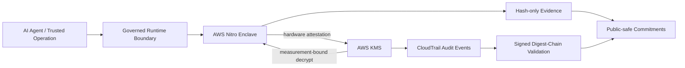

# V8 — Hardware-Attested AI Agent Runtime

[](https://github.com/vladislavnaidenkopro-code/hardware-attested-ai-agent-runtime/actions/workflows/verify.yml)

Public technical showcase of a security architecture for high-trust AI-agent execution using confidential computing, measurement-bound secret access, fail-closed trust decisions, and tamper-evident audit evidence.

> **Status:** V8.0 is the frozen verified baseline represented by this showcase. V8.1 productization work continues privately and is not presented here as released functionality.

## Why this exists

Autonomous AI agents can call tools, move data and trigger external effects. For sensitive operations, application logs and text-only guardrails are not sufficient evidence of where secret-bearing code executed or which measured workload was permitted to use a key.

V8 explores a stronger trust model: bind sensitive secret access to an attested runtime measurement and preserve public-safe cryptographic commitments to the resulting evidence.

## Verified V8.0 baseline

The private verification run established the following properties for the frozen V8.0 baseline:

- measured AWS Nitro Enclave execution;
- measurement-bound AWS KMS authorization;
- negative and positive attestation paths;
- enclave-only plaintext handling in the verified flow;
- provider-side CloudTrail attestation evidence;
- signed CloudTrail digest-chain validation;
- exact membership of the target event in a verified audit log;
- clean secret-print scan for the exported evidence set;
- release preflight and regression validation.

Public commitments are retained in [`evidence/HASH_COMMITMENTS.json`](evidence/HASH_COMMITMENTS.json).

## Architecture



The architecture is designed around **fail-closed authorization**, **measurement-bound trust**, **secret minimization**, and **evidence preservation**.

## Public verifier

This repository includes a dependency-free verifier for the public commitment manifest:

```bash
python tools/verify_public_manifest.py evidence/HASH_COMMITMENTS.json
python -m unittest discover -s tests -v
```

The verifier checks schema shape, SHA-256 formatting, expected commit-SHA formatting, duplicate commitment values, and the required non-claim set. It does **not** expose or reconstruct private evidence.

## What is intentionally not here

This repository does not include:

- private implementation source code;
- AWS account IDs, ARNs, IP addresses or credentials;
- raw CloudTrail logs or internal IAM/KMS policy documents;
- recovery archives, deployment secrets or customer information;
- private V8.1 implementation details.

## Documentation

- [`docs/ARCHITECTURE.md`](docs/ARCHITECTURE.md) — trust boundary and execution sequence
- [`docs/VERIFIED_STATUS.md`](docs/VERIFIED_STATUS.md) — what is verified versus in development
- [`docs/THREAT_MODEL.md`](docs/THREAT_MODEL.md) — threat assumptions and control boundaries
- [`docs/ROADMAP.md`](docs/ROADMAP.md) — public-safe development direction
- [`docs/REPRODUCIBILITY.md`](docs/REPRODUCIBILITY.md) — what a reviewer can reproduce from this repository
- [`SECURITY.md`](SECURITY.md) — disclosure and security policy

## Public showcase release

The curated public snapshot is published as [`showcase-v8.0-20260928`](https://github.com/vladislavnaidenkopro-code/hardware-attested-ai-agent-runtime/releases/tag/showcase-v8.0-20260928). This tag identifies the public showcase, not the private V8.0 implementation repository.

## Non-claims

This showcase does not claim production readiness, regulatory certification, an SLA, universal attack prevention, customer security outcomes, or exactly-once external delivery semantics.

## License

Portfolio and evaluation use only. See [`LICENSE`](LICENSE).
